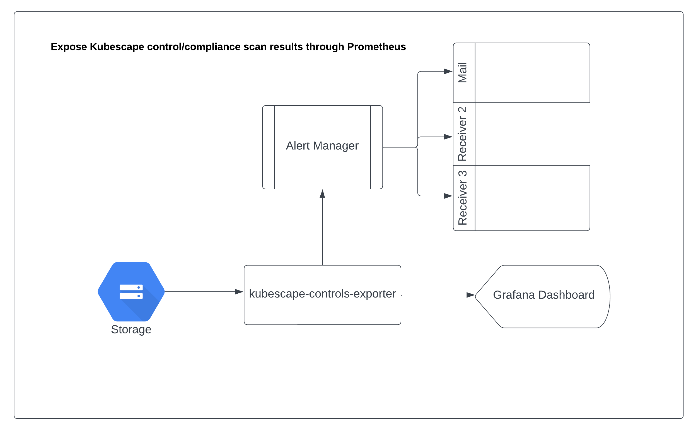
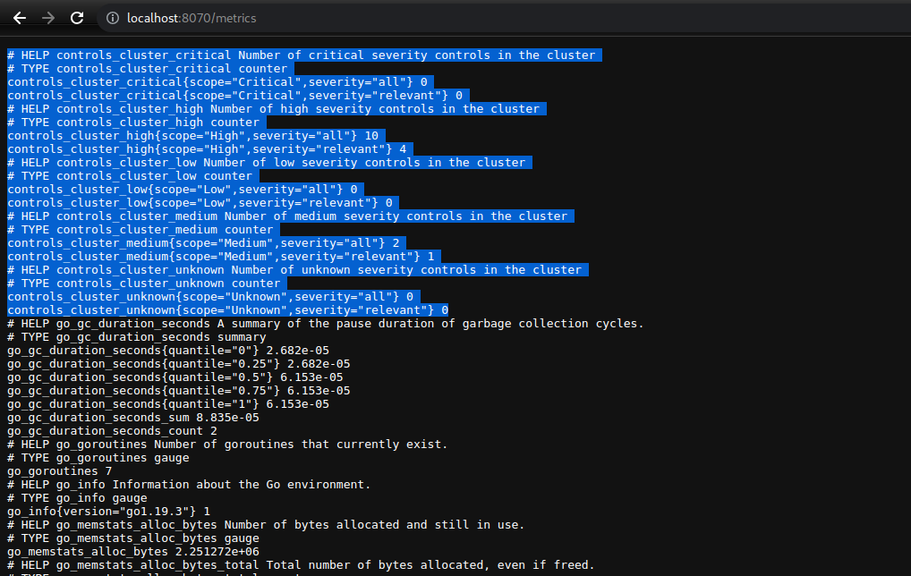
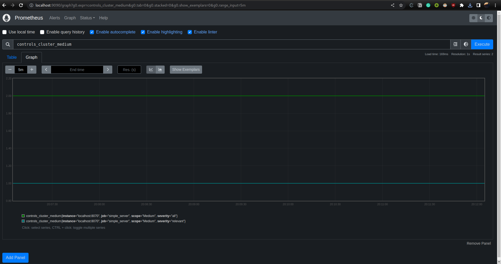
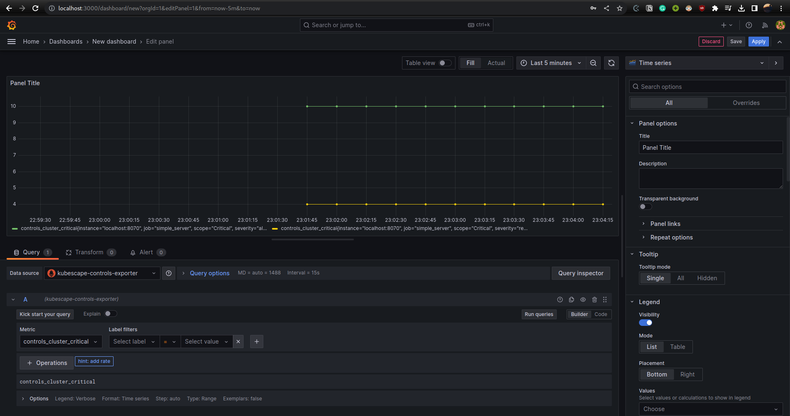
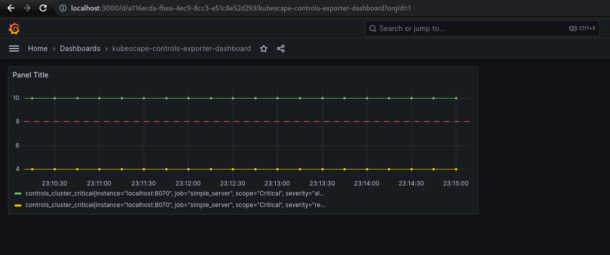

# kubescape-control-exporter

- Developed an exporter to expose the metrics extracted from the stored scan object using Go and Prometheus.
- Currently it takes the reads the scan object statically from the local file system and exposes the metrics on the port 8070.
- Prometheus is configured to scrape the metrics and the prometheus web-UI can be accessed on the port 9090.

## Exposed Metrics 
The metrics to be exposed are as follows (for both cluster and namespace scope):
- Critical Controls
- High Controls
- Medium Controls
- Low Controls
- Unknown Controls

**Note:** Currently, only cluster scope is considered.

## How to run
- Clone the repository
- Build the exporter
```
go build .
```
- Run the exporter
```
./kubescape-control-exporter
```
- Run Prometheus
```
prometheus --config.file=prometheus.yml
```
- Access the metrics on the port 8070
- Access the Prometheus web-UI on the port 9090

## Outputs
1. Design of the exporter:

2. Metrics exposed:

3. Prometheus web-UI:

4. Grafana dashboard:




